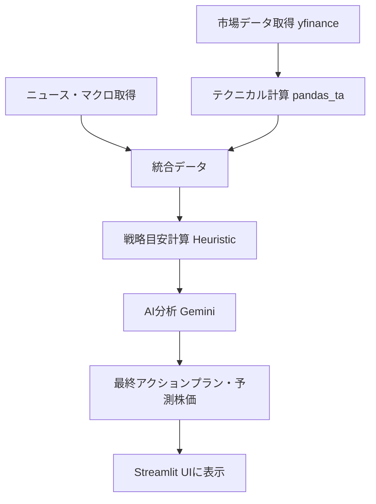

# Kabuzan システム構成・分析ロジック概要

本ドキュメントでは、AI株価分析アプリ「Kabuzan」のシステム構成、使用技術、および AI による分析・予測ロジックについて詳細に説明します。

---

## 1. システム構成 (Architecture)

本アプリは、Python ベースの軽量かつ多機能なスタックで構成されています。

- **フロントエンド・UI**: [Streamlit](https://streamlit.io/)
  - データサイエンスに特化した Web フレームワークを使用し、リアルタイムなインタラクションを実現。
- **データソース (Market Data)**: [yfinance](https://github.com/ranaroussi/yfinance)
  - Yahoo Finance API を通じて、日足・週足の株価（OHLCV）、ファンダメンタルズ指標を取得。
- **データベース・永続化**: [Google Sheets](https://www.google.com/sheets/about/)
  - ウォッチリストやポートフォリオ、設定情報の保存に Google Sheets を使用。サーバーレス環境でも永続性を維持。
- **AI エンジン**: [Google Gemini 1.5/2.0/3.0 Series](https://ai.google.dev/)
  - 構成上、最新かつ高速な `gemini-3-flash-preview` を優先的に使用して、高度な論理推論と分析を実行。

---

## 2. 使用ライブラリ (Technology Stack)

| カテゴリ | ライブラリ名 | 用途 |
| :--- | :--- | :--- |
| **Web Framework** | `streamlit` | ダッシュボード UI、各種ウィジェットの提供 |
| **Data Fetching** | `yfinance`, `requests`, `bs4` | 市場データ、ニュース、マクロ指標の取得 |
| **Computing** | `pandas`, `numpy` | データ処理、数値計算 |
| **Technical Analysis**| `pandas_ta` | 移動平均(SMA)、ボリンジャーバンド(BB)、RSI、MACD、ATR 等の算出 |
| **Visualization** | `lightweight-charts` | インタラクティブな金融チャート（TV チャート形式）の描画 |
| **Database** | `duckdb` | 高速な分析処理のためのインプロセス SQL エンジン |
| **Cloud Integration** | `gspread`, `st-gsheets-connection` | Google Sheets との連携 |
| **LLM SDK** | `google-genai` | Gemini API との高度な連携 |

---

## 3. AIによる分析・予測ロジック

本アプリの予測価格算出は、「**ヒューリスティック計算**」と「**AIによる定性評価**」のハイブリッド方式を採用しています。

### A. テクニカル指標の計算（前処理）
1. `yfinance` から取得した価格データに対し、`pandas_ta` を用いて以下の指標を算出します。
   - トレンド指標: SMA (5, 25, 75)
   - オシレーター: RSI (14), MACD
   - ボラティリティ: ボリンジャーバンド, ATR (Average True Range)

### B. 戦略目安の算出 (Heuristic Calculation)
AIに渡す前に、数学的なロジックで「計算上の目安」を算出します (`modules/analysis.py`)。
- **エントリー価格**: 主要なサポートライン（SMA25, 75やBB下限）付近を設定。
- **利確目安 (Target Price)**: ボリンジャーバンドの上限や直近のレジスタンスラインをベースに算出。
- **損切目安 (Stop Loss)**: ATR（ボラティリティ）に基づいた「動的な損切り」または固定パーセンテージによるリスク管理。

### C. AI分析フロー (Virtual Investment Committee)
取得したデータと計算結果を AI（Gemini）に投入し、以下の **「仮想投資戦略会議」** プロンプトを実行します (`modules/llm.py`)。

1. **専門家ロールプレイ**:
   - **テクニカル担当**: 指標の数値からトレンドを論理的に解釈。
   - **需給・市場心理担当**: 信用倍率、ドル円、日経平均との相関を分析。
   - **ファンダメンタル担当**: PBR/PERの見地やニュース、決算書き起こし（Transcript）を評価。
2. **論理バトル (Bull/Bear Debate)**:
   - 強気派と弱気派の AI エージェントを対立させ、それぞれの立場から定量的な根拠に基づいた論理バトルを行わせることで、「期待」的な偏りを排除。
3. **最終投資判断**:
   - ヒューリスティックに算出された目標株価に対し、AI が地合いやリスクを考慮して微調整。
   - 「なぜその価格になるのか」の論理的根拠 (Reasoning) と共に、最終的な星評価（スコア）を出力。

---

## 4. データフローのまとめ

この多層的なアプローチにより、単なる「チャート予測」に留まらない、ファンダメンタルズと需給を考慮した実戦的な投資判断をサポートしています。
