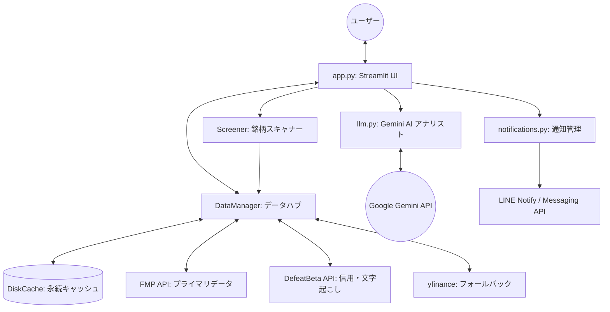

# Kabuzan System Architecture & Design Specification (v2.1)

このドキュメントは、Kabuzan アプリケーションの設計、技術スタック、および各コンポーネントの動作原理を詳細に解説したものです。

## 1. システム概要
Kabuzan は、日本株（および米国株）を対象とした、テクニカル分析と生成AI（Google Gemini）による定性分析を統合した投資支援ダッシュボードです。

- **コアバリュー**: リアルタイム株価、マルチタイムフレーム分析、ニュースセンチメントを組み合わせ、プロの証券アナリスト視点での「総合投資判断スコア」と戦略を自動生成する。
- **デプロイ環境**: Streamlit Cloud

## 2. 技術スタック (Tech Stack)
- **Frontend/UI**: Streamlit (Python)
- **Data Acquisition**: 
  - **Financial Modeling Prep (FMP)**: プライマリ（株価、財務、指標）
  - `defeatbeta-api`: 日本株固有データ（信用需給、決算文字起こし）
  - `yfinance`: バックアップ（株価データ、ニュース）
- **Technical Analysis**: `pandas-ta`
- **AI/LLM**: Google Gemini API (`google-genai` V1 SDK)
- **Caching**: `diskcache` (SQLite ベースの永続化キャッシュ)
- **Visualization**: `plotly` (マルチタイムフレーム・インタラクティブ・チャート)
- **Notifications**: LINE Notify API

## 3. システムアーキテクチャ (Component Layout)

### 主要モジュール解説
1.  **`app.py` (Orchestrator)**:
    - 状態管理とUIレンダリング。
    - **マルチタイムフレーム UI**: 日足・週足をタブで切り替える機能。
2.  **`modules/data_manager.py` (Data Layer)**:
    - **3-Tier Fallback Mechanism**: データの完全性を保証するため、`FMP` -> `DefeatBeta` -> `yfinance` の順に透過的にデータ取得を試行。
    - **Multi-Timeframe Support**: 日足（1d）と週足（1wk）のデータ取得・指標計算を統合。
    - 指標期間の自動調整（日足: 5/25/75, 週足: 13/26/52）。
3.  **`modules/llm.py` (AI Intelligence Layer)**:
    - **対話型深層思考 (Self-Reflection)**: プロンプト内で「強気派」と「弱気派」のアナリストを擬似的に対話させ、両者の視点を統合してから結論を出すロジック。
    - **マルチモデル・フォールバック**: `gemini-3-flash-preview`を最優先し、エラー時に`gemini-2.5-flash-lite`等へ自動的に切り替える仕組み。
    - **指数バックオフ (Exponential Backoff)**: `tenacity`ライブラリを使用し、レート制限(429)発生時に待機時間を指数関数的に増やしてリトライ(最大5回)。
    - **ニュース感情分析**: ニュースタイトルから市場心理を抽出し、テクニカルスコアと統合した「総合判定スコア」を算出。
    - **具体的トレードプラン**: エントリー、利確(TP)、損切(SL)、リスクリワード比を数値で算出。
    - **Structured Output (JSON)**: AI回答を厳格なJSONスキーマで受け取り、UIで「Setupカード」として視覚化。
    - **マルチソース統合**: FMP(財務)/yfinance(ニュース)等のデータを統合。
4.  **`modules/news.py` (News Module)**:
    - `yfinance` 経由でキャッシュを考慮した効率的なニュース取得。
5.  **`modules/charts.py` (Visualization)**:
    - 期間選択（1m, 3m, 6m, 1y, All）、ダークモード最適化、マルチタイムフレーム対応。
6.  **`modules/notifications.py`**:
    - 特定のテクニカル条件（RSIやボリンジャーバンド）に基づく自動通知。

## 4. データフロー (Data Flow)
1.  **データ収集**: 銘柄コード入力により、日足・週足の株価データおよび最新ニュースを同時取得。
2.  **指標計算**: 各時間軸に応じたテクニカル指標を計算。
3.  **センチメント解析**: 取得したニュースタイトルからAIが市場心理を数値化。
4.  **総合分析**: LLMがテクニカルとニュースを統合し、詳細なレポートとターゲット価格を生成。
5.  **シグナル検知**: 条件合致時に LINE Notify 経由でユーザーへプッシュ通知。

## 5. 独自のロジック
- **ハイブリッド・スコアリング**: テクニカルの客観データと、ニュースの主観的センチメントを 6:4 の比率で統合。
- **マルチタイムフレーム戦略**: 週足のトレンドに逆らわない日足のエントリー。

## 6. セキュリティ
- `secrets.toml` で API キーと LINE トークンを管理。
