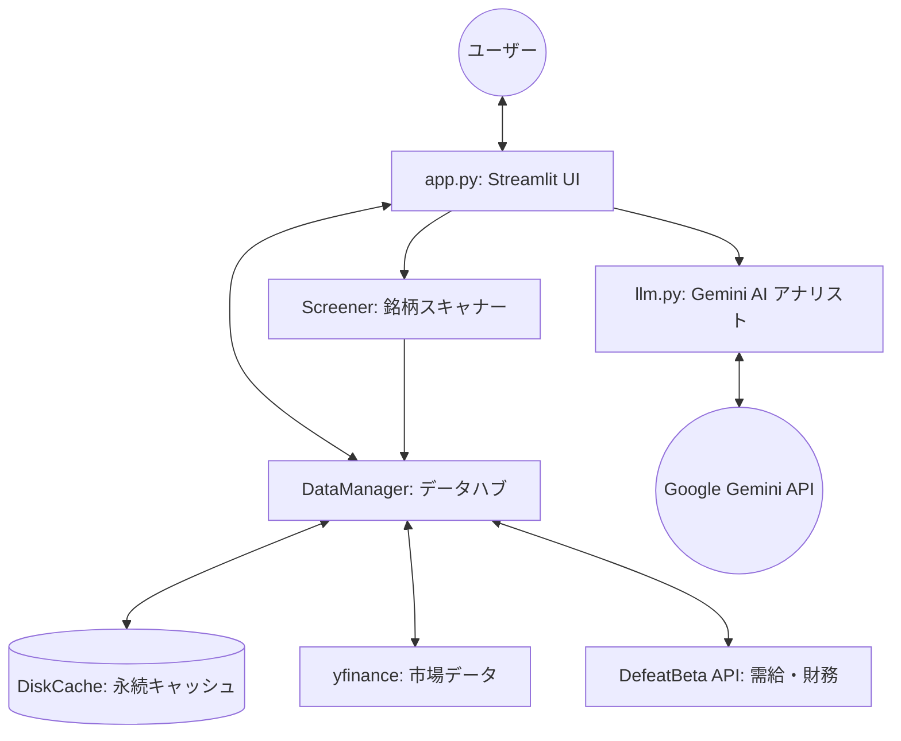

# Kabuzan System Architecture & Design Specification

このドキュメントは、Kabuzan アプリケーションの設計、技術スタック、および各コンポーネントの動作原理を詳細に解説したものです。他の生成AIや開発者がシステムを理解し、拡張するための「設計図」として機能します。

## 1. システム概要
Kabuzan は、日本株（および米国株）を対象とした、テクニカル分析と生成AI（Google Gemini）による定性分析を統合した投資支援ダッシュボードです。

- **コアバリュー**: リアルタイム株価データと財務データを組み合わせ、プロの証券アナリスト視点での「戦略判定（エントリー・利確・損切）」を自動生成する。
- **デプロイ環境**: Streamlit Cloud (高速なUI反復と、重量級ライブラリのサポートのため)。

## 2. 技術スタック (Tech Stack)
- **Frontend/UI**: Streamlit (Python)
- **Data Acquisition**: 
  - `yfinance` (リアルタイム株価、基本財務データ)
  - `defeatbeta-api` (独自の信用需給・財務概況データへのフォールバック)
- **Technical Analysis**: `pandas-ta` (EMA, SMA, RSI, MACD, Bollinger Bands, ATR 等)
- **AI/LLM**: Google Gemini API (`google-genai` V1 SDK)
- **Caching**: `diskcache` (SQLite ベースの永続化キャッシュ。/tmp 領域を使用)
- **Visualization**: `plotly` (インタラクティブ・チャート)

## 3. システムアーキテクチャ (Component Layout)

### 主要モジュール解説
1.  **`app.py` (Orchestrator)**:
    - 状態管理 (`st.session_state`) を担当し、ウォッチリスト、ポートフォリオ、UIタブの切り替えを制御。
    - 各タブ（チャート、AI分析、ポートフォリオ、スキャン、データ）のレンダリング。
2.  **`modules/data_manager.py` (Data Layer)**:
    - **Hybrid Sourcing**: 複数ソースからデータを収集・マージ。
    - **Indicator Calculation**: `pandas-ta` を用いた堅牢な指標計算。欠落データに対するデフォルト値補完機能を備える。
    - **Caching Policy**: 環境（ローカル/Cloud）に応じたキャッシュパスの自動切り替え。
3.  **`modules/llm.py` (AI Intelligence Layer)**:
    - **Structured Prompting**: テクニカル指標、財務データ、マーケット地合いを構造化したプロンプトに変換。
    - **Model Fallback**: 複数の Gemini モデル（2.0-flash, 1.5-pro 等）を順次試行するフォールバックロジック。
    - **Persona Interface**: 証券アナリストのペルソナによる戦略提案。
4.  **`modules/charts.py` (Visualization)**:
    - `plotly` を使用し、移動平均線、シグナルライン、戦略価格（SL/TP）を視覚化。

## 4. データフロー (Data Flow)
1.  **入力**: ユーザーが銘柄コード（例: 7203）を入力。
2.  **収集**: `DataManager` がキャッシュを確認。なければ `yfinance` 等からデータを取得。
3.  **加工**: 取得したデータからテクニカル指標を算出 (`pandas-ta`)。
4.  **推論**: 直近の指標、トレンド、財務情報を `llm.py` が集約し、Gemini API へ送信。
5.  **出力**: Gemini が出力した Markdown 日本語レポートを UI に表示。

## 5. 独自の強みとロジック
- **戦略算出アルゴリズム**: 単なる分析に留まらず、ボラティリティ（ATR）や直近サポート/レジスタンスを考慮したエントリー・ターゲット価格を自動算出。
- **堅牢なエラーハンドリング**: 指標が計算できない場合でも AI 分析が停止しないよう、メタデータとしての「不確実性」を AI に伝えつつ分析を続行。
- **モバイル最適化**: Streamlit の `wide` レイアウトと、スマホ表示を意識したカード形式・表形式の使い分け。

## 6. API セキュリティ
- Streamlit Cloud の `Secrets` 管理機能を活用し、`GEMINI_API_KEY` を安全に保持。ローカル環境では `secrets.toml` または `.env` を使用。

---
このシステムは、データの正確性（Technical Indicators）と解釈の深さ（Gemini AI）を両立させることを主眼に設計されています。
